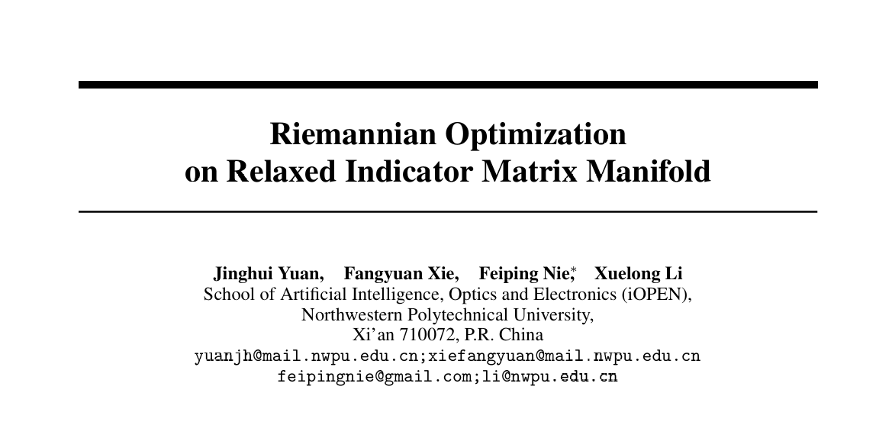
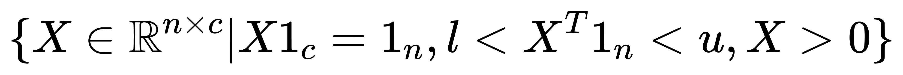
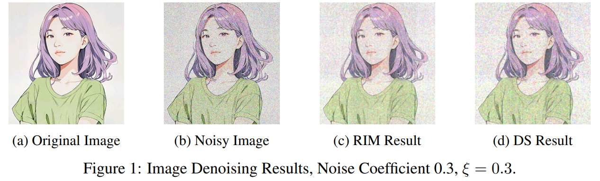
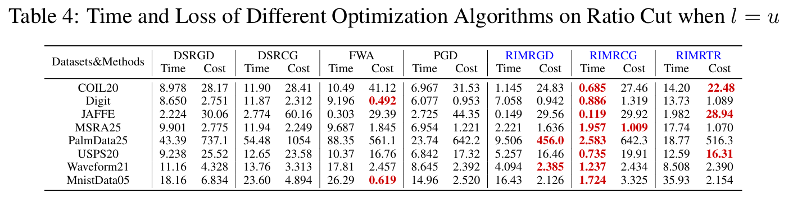
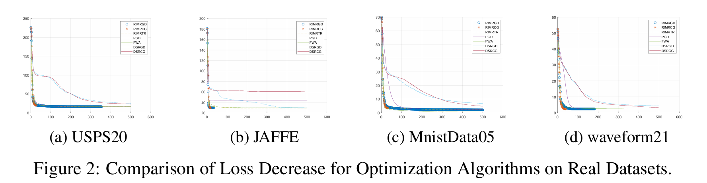

# Riemannian Optimization on Relaxed Indicator Matrix Manifold

<!-- Insert cover image here -->

<p align="center">
  
</p>

<p align="center">
  <a href="https://arxiv.org/abs/2503.20505"></a>
    <a href="https://www.manopt.org/"></a>
  <a href="https://ww2.mathworks.cn/products/matlab.html"></a>
  <a href="https://opensource.org/licenses/MIT"></a>
</p>


## 📜 Introduction

This is the official implementation of our paper "[Riemannian Optimization on Relaxed Indicator Matrix Manifold](https://arxiv.org/abs/2503.20505)" . We propose a fundamental manifold in machine learning—the Relaxed Indicator Matrix (RIM) manifold—and develop a set of Riemannian optimization methods on the RIM manifold.

> The optimization of the indicator matrix manifold is an NP-hard discrete optimization problem. We relax it into a continuous form, where each row is a probability vector summing to 1, and each column satisfies constraints within a certain range. 

<p align="center">
  
</p>

> These constraints are prior information that can be incorporated into machine learning systems. Specifically, when the column constraints are sufficiently relaxed, the manifold degenerates into a single-stochastic manifold, and when the constraints are sufficiently tight, it degenerates into a double-stochastic manifold. 

> Therefore, our manifold possesses generalizability.

## 🔑 Key Features and Contributions

- **Broad application space:** In most tasks such as clustering and classification that require learning an indicator matrix, relaxing to the RIM manifold may be a viable alternative to relaxing to the single-stochastic manifold (K-means) or the Stiefel manifold (spectral clustering).
- **Introducing column sum information:** Compared to other relaxation methods, this approach incorporates column sum information into the indicator matrix, representing the probability distribution of each category. This provides learning systems with additional prior information that can be leveraged.
- **Complete theory:** We provide a full proof, including the Riemannian gradient and Retraction mapping, ensuring the completeness of our work.
- Efficiency and effectiveness of the algorithm: In some tests, the speed $\mathcal{O}(n)$ surpasses that of the double-stochastic manifold $\mathcal{O}(n^3)$. Additionally, compared to various existing algorithms, it achieves a lower optimization objective value. At the same time, it significantly improves clustering performance and can also serve as a post-processing tool to enhance clustering results.

## 🏆 Acceptance and Publication

- **arXiv Preprint**: [arXiv:2503.20505](https://arxiv.org/abs/2503.20505)
- Please stay tuned for further updates ……

## 📊 Performance Highlights

For the **image denoising problem**, comparing the RIM manifold and the double-stochastic manifold:
RIM manifold time: **<span style="color:red;"> 29.77s</span>**, loss value: **<span style="color:red;">1.05e5</span>**. While double-stochastic manifold took **<span style="color:red;">85.33s</span>** and the loss function was **<span style="color:red;">1.17e5</span>**.

<p align="center">
  
</p>

Here is the comparison table of various optimization algorithms' time and loss values for the **Ratio Cut** problem:

<p align="center">
  
</p>

Here is the **loss function descent curve** for some datasets:

<p align="center">
  
</p>

For additional information, including images and tables,**<span style="color:red;">  please refer to the [paper]((https://arxiv.org/abs/2503.20505)).</span>** 


## 💻 Repository Contents

- **Code**:
  - `Relaxd_Indicator_Matrix_factory.m`: This is the core file, a Riemannian geometry toolbox compatible with [Manopt](https://www.manopt.org/), specifically designed for the RIM manifold.
- **demo**:
  - `RIM_denoising.m`: This is the file for quickly testing the RIM manifold for denoising.
  - `yjh.png`: This is the same cartoon image used for testing in your paper.

## ⚙️ Installation

- **Manopt:** To use the RIM manifold Riemannian toolbox based on [Manopt](https://www.manopt.org/), you first need to ensure that [Manopt](https://www.manopt.org/) is installed.
- **Download file:** Please download the RIM manifold files as follows.

```bash
# Clone the repository
git clone https://github.com/Yuan-Jinghui/Riemannian-Optimization-on-Relaxed-Indicator-Matrix-Manifold.git
```

- **Place core files:** Please place the files as follows.

```bash
-manopt;
 --manifolds;
    ---multinomial;
        ----Relaxd_Indicator_Matrix_factory.m
```

```bash
-manopt;
 --examples;
    ---RIM_denoising.m;
    ---yjh.png;
```

- **Run the code!** : Add all the files to the path and run `RIM_denoising.m` in the MATLAB command line.

## ❤ Citation

If you find our work useful in your research, please consider citing:

```bibtex
@misc{yuan2025riemannianoptimizationrelaxedindicator,
      title={Riemannian Optimization on Relaxed Indicator Matrix Manifold}, 
      author={Jinghui Yuan and Fangyuan Xie and Feiping Nie and Xuelong Li},
      year={2025},
      eprint={2503.20505},
      archivePrefix={arXiv},
      primaryClass={cs.LG},
      url={https://arxiv.org/abs/2503.20505}, 
}
```

## ✨Acknowledgements

We would like to thank the manifold optimization community for their support, including [Manopt](https://www.manopt.org/), [Manopt.jl](https://manoptjl.org/stable/), and their authors. We also appreciate **<span style="color:red;">You</span>** who reads and cites the article, and use the RIM manifold for research.

## 📝 License

This project is licensed under the MIT License - see the [LICENSE](LICENSE) file for details.

---

<p align="center">
  <i>For questions and inquiries about this research, please refer to the contact information in the paper.</i>
</p>
